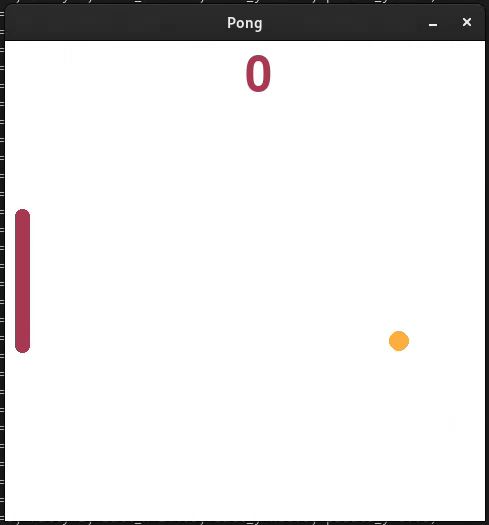

<!-- Heading: Start -->
<h1 align="center">
  <a>
    
  </a>
</h1>

Welcome to my Computer Science Bachelor's Thesis!

📖 **Read the full thesis** (🇧🇷): [Click here][final_thesis]. 

📊 **Thesis Presentation Slides** (🇧🇷): [View Slides][presentation].


## TL;DR
- **What is Active Inference (AIF)?** 
  - Active Inference (AIF) is a theoretical framework suggesting that all behavior and cognition can be viewed as a process of **minimizing the discrepancy** between an organism's **model of the world** and its **observations**. This involves either aligning beliefs with observations or taking actions to ensure future observations are consistent with existing beliefs.

- **Neurons Playing Pong:** 
  - [Kagan et al. (2022)][kagan2022] developed "Dishbrain", a pioneer biotechnological interface that successfully embeds neurons into a virtual environment of the **Pong** game through electrophysiological feedback **protocols** derived from **AIF**. The core idea is to provide **unpredictable feedback to undesirable behavior**. Remarkable, the neurons adapted their structure and activity patterns to improve paddle control and minimize game losses, with noticeable changes occurring within just five minutes of gameplay!
  
- **PingPOMDP:**
  - My research hypothesis is that a [simple generic AIF model][pymdp] can demonstrate similar performance to the neurons (presumed to operate under AIF) when interacting with Pong through DishBrain's protocols. I developed "PingPOMDP" to orchestrate model, interface, environment and the run of experiments. This simple POMDP model successfully learned to play Pong, supporting the hypothesis that the protocols can guide learning in computational models as well as biological neurons. 

- **Future Aspirations**:
  - I envisage this project as a stepping stone towards creating a computational framework based on DishBrain's interface. This would pave the way for future research to compare various models using standardized protocols that could potentially correlate with in vitro neuron culture experiments.

<div align="center">
  <div style="display: inline-block; margin-right: 10px; text-align: center;">
    
    <br>
    <em>DishBrain's neuron culture playing Pong</em>
  </div>
  <div style="display: inline-block; text-align: center;">
    
    <br>
    <em>POMDP model playing Pong</em>
  </div>
</div>

## Running 

Install the requirements:
```sh
pip install -r requirements.txt
```

Run: 
```sh
python -m pingpomdp.pingpomdp
```

## Conceptual model  


- **PingPOMDP** orchestrate the components of the project:
  - Agent: The [POMDP-AIF model][pymdp] interacting with the environment.
  - Environment: The Pong game setup.
  - GridLink: The interface that connects agent and environment.
  - Database and Configurations: Stores and manages project configurations and data.


- **GridLink**: 
  - translate the **environment state** into an **observation** to the agent. 
  - translate the **agent action** into an **environment action**. 
  - Both oriented by the DishBrain's protocols.

## Protocols
  <div style="display: inline-block; text-align: center;">
    
    <br>
    <em>DishBrain's Electrode Layout</em>
  </div>

- DishBrain's protocols:
  - Neurons are cultivated over an electrode grid.
  - Each electrode can read and administer local eletrical pulse. 
  - Eight electrodes were arbitrarily defined as "stimulation eletrodes". They provide three stimuli:
    - 1. sensorial feedback: activate one of the eight electrodes to encode the ball position relative to the paddle.
    - 2. Predictable feedback: after a hit, activate the eight electrodes for 100ms. 
    - 3. Unpredictable feedback: after a miss, randomly activates and deactivates the eight electrodes for 4000ms.
  - Four arbitrary regions were defined as a "motor area":
    - If there is more activity in region 1, the paddle moves up
    - If there is more activity in region 2, the paddle moves down


- Protocol's rationale:
  - If organisms act to minimize the discrepancy between their world model and observations, they effectively minimize the prediction error of their models. 
  - Nothing is more unpredictable than randomness. In this sense, random observations are negative feedback.
  - We expect that an organism will avoid states related to unpredictable observations.  
  - We expect that an organism will reforce behaviors related to predictable observations. 
  - In DishBrain, to avoid unpredictable feedback, the neurons had to somehow correctly interpret the sensory feedback, and intentionally change its activity in the motor area to control the paddle accordingly. That's why their result is so remarkable!  
  - My idea of building a computational version is to explore just how applicable those first principles are. Because neurons are complex machines, what about the simple generic formulation that aims to explain this complex behavior? What would happen if we strip to the principles? Would there be learning too? Indeed seemed to be, in some configurations, not in others. Why? That's the fun part: I don't know! 

## Some more pretty pictures 
  <div style="display: inline-block; text-align: center;">
    
    <br>
    <em>GridLink as used in the thesis</em>
  </div>

  <div style="display: inline-block; text-align: center;">
    
    <br>
    <em>Sensory Feedback</em>
  </div>

  <div style="display: inline-block; text-align: center;">
    
    <br>
    <em>Comparing my metrics to DishBrain's</em>
  </div>

## You are very welcome to reach out! 
📫 danielbrito (at) pq.uenf.br 

<div align="center">
  <a>
  <br>
    
  </a>
</div>

[logo]: docs/logo.png
[final_thesis]: docs/uenf23_tcc_DanielBrito.pdf
[monograph_first_draft]: docs/PingPOMDP.pdf
[presentation]: https://docs.google.com/presentation/d/1M8LMyMz1cauvde3aQ-8Wut_GfCuVIoBP8k4innidxU8/edit?usp=sharing
[kagan2022]: https://www.cell.com/neuron/fulltext/S0896-6273(22)00806-6
[pymdp]: https://github.com/infer-actively/pymdp
[img:kagan22_conceptual]: docs/kagan22_conceptual_model.jpg
[img:kagan22_abstract]: docs/kagan22_graphical_abstract.jpg
[img:kagan22_electrode_layout]: docs/kagan22_electrode_layout.jpg
[img:gridlink_layout]: docs/grid_layout.png
[img:pingpomdp_conceptual]: docs/pingpomdp_conceptual.png

